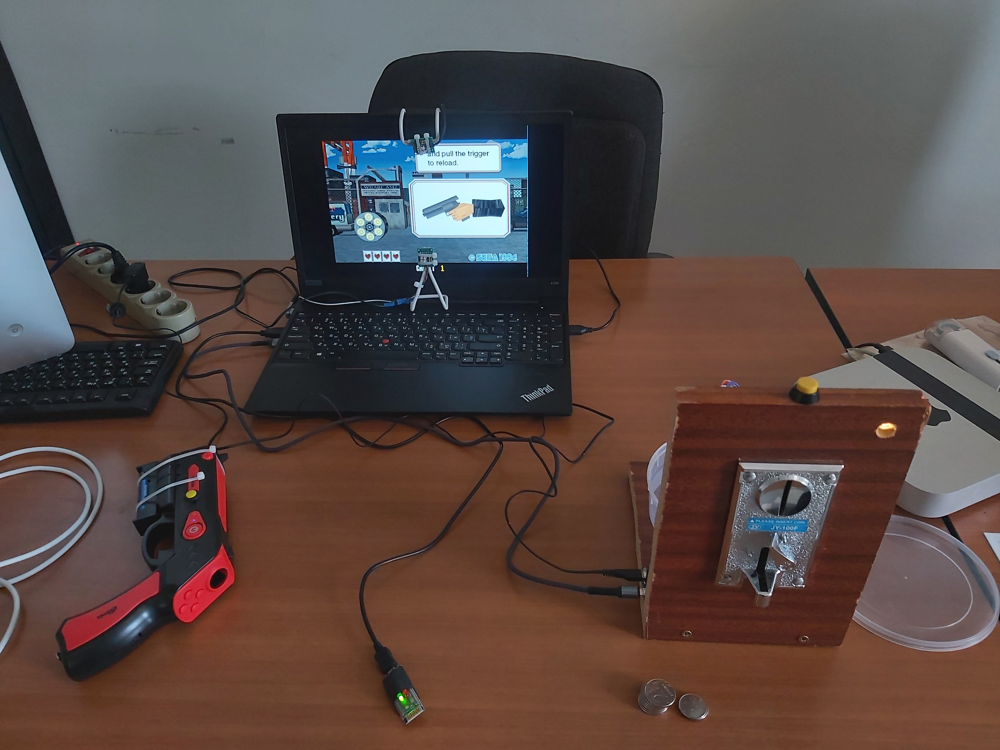

# Light gun

Video demo:  
https://youtu.be/HeBRopewjwI  
[](https://www.youtube.com/watch?v=HeBRopewjwI)


Fully set up "arcade cabinet":  
    
   


Based on SAMCO Light Gun project:   
https://github.com/samuelballantyne/IR-Light-Gun  
https://www.instructables.com/DIY-Arduino-Powered-IR-Light-Gun/  

IR camera:   
https://www.dfrobot.com/product-1088.html  
Toy gun used as base:  
http://old.ritmixrussia.ru/products/gp-056bth 

Features:  
- Only two IR right sources are used
- IR lights are placed vertically in contrary to original horizontal mount to decrease minimum working distance
- IR camera is rotated to 90 degrees to increase vertical FOV
- Support both wireless (via USB dongle) and wire (via USB) connection
- Calibration is stored in ROM of microcontroller
- Emulates WASD buttons on keyboard (buy for butons on the gun), mouse left (pull trigger when point to the screen) and right buttons (pull trigger when point outside the screen), mouse movement (aim to the screen)
- Button debounce is improved
- Processing sketch for debugging is improved 
- Light gun and USB dongle are based on Arduino Micro boards (compatible with Arduino Leonardo)  

Assembled light gun:  
  

USB dongle:  
    

Ir lights:   
  
  
  

L-34F3C infrared LEDs are used for IR lights. [Datasheet](L-34F3C(Ver.19A).pdf)  

Usage instruction (see `light_gun.ino` file):  
````C++
// Reciever led very fast alternate blink: camera is disconnected
// Reciever led slow alternate blink: LightGun is disconnected

// Side leds: red and blue for two detected points
// Side leds very fast alternate blink: camera is disconnected
// Side button: pause
// Side button long press: print help
// Side button press while hold up button: calibrate
// Side button press while hold left button: reset

// Press up button during startup for enable logs

// Controls: WASD, trigger: left mouse button (on screen) or right mouse button (off screen)
````


## Making of

Wiring inside the gun:
  

First prototype video demos:  
https://youtu.be/cEvMrEhZWUk  
[](https://www.youtube.com/watch?v=cEvMrEhZWUk)  
https://youtu.be/pTYC2ANSO9U  
[](https://www.youtube.com/watch?v=pTYC2ANSO9U)  

Toy gun used as base:   
  

First assembly with Arduino Leonardo and prototyping shield:   
  

First ir lights:  
   

First version of wiring:   
  
  
Work in progress:  
  


